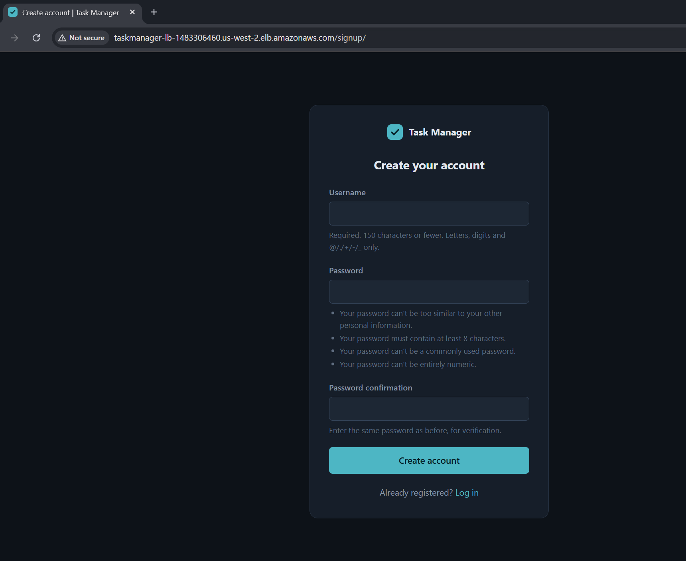
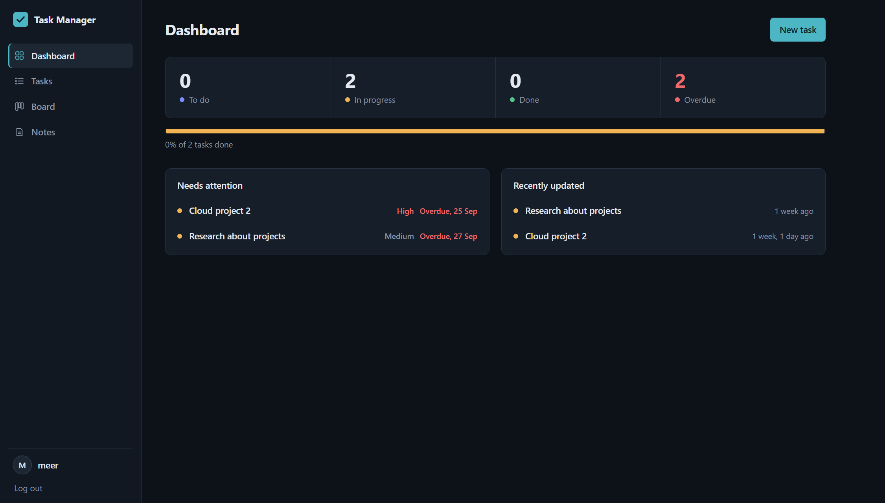
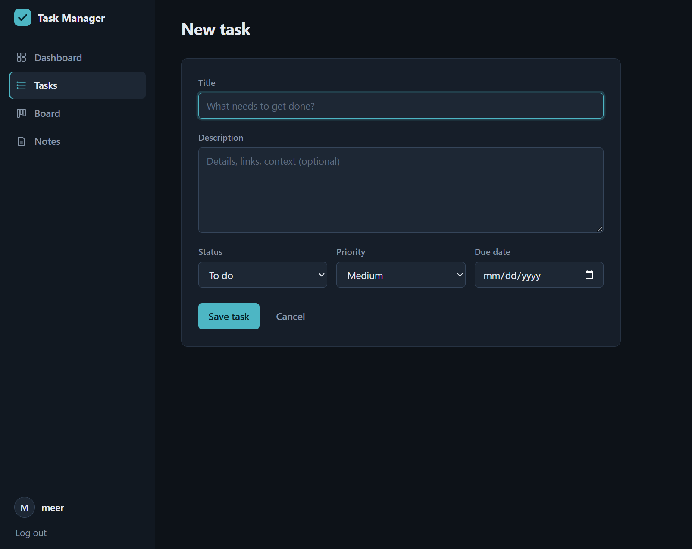
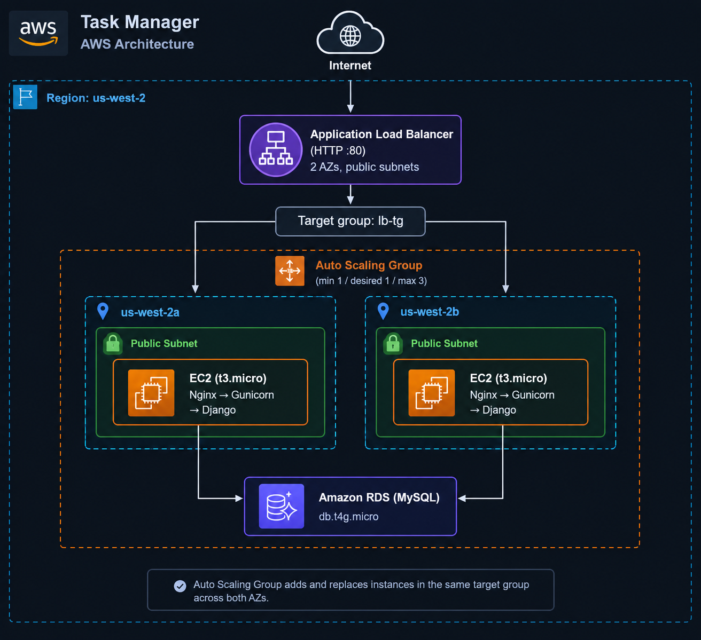
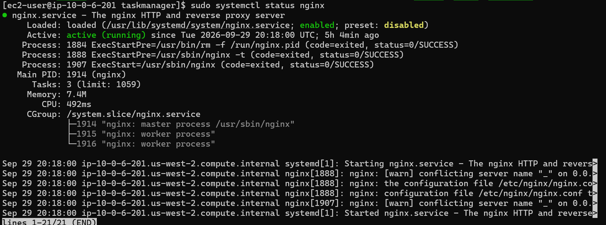
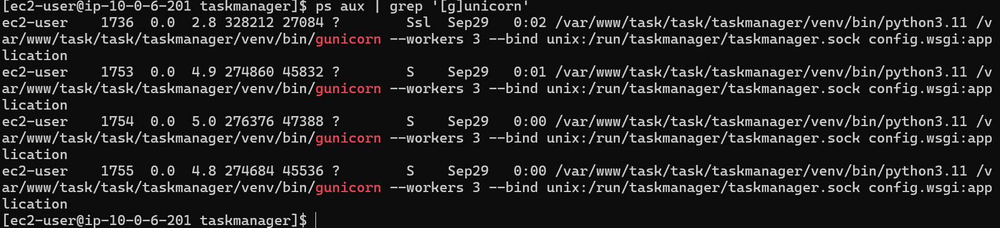

# Task Manager

**A Django task and notes manager deployed on a highly available, load-balanced AWS architecture.**
Users create an account, manage tasks on a dashboard and kanban board, and keep searchable notes. The app runs behind an Application Load Balancer across two Availability Zones, with an Auto Scaling Group and a managed MySQL database on Amazon RDS.

**Live demo:** The deployment is currently stopped to keep AWS costs down. The screenshots below show the running application.

---

## Screenshots

| Login/Signup | Dashboard | New-Task |
|---|---|---|
|  |  |  |

---

## Overview

Task Manager is the traditional, server-based project in my AWS portfolio. It is the counterpart to my serverless projects (Docket and Thumbly): the same idea of authenticated users managing their own data, but built on EC2, a load balancer, auto scaling, and a managed relational database instead of Lambda and DynamoDB.

## Features

- Account signup and login (Django authentication)
- Task CRUD with title, description, status, priority, and due date
- Dashboard with To do / In progress / Done / Overdue counts, a progress bar, a "Needs attention" list, and recently updated tasks
- Kanban board with To do, In progress, and Done columns
- Notes with search
- Dark, responsive UI

---

## Architecture



**Request flow**

1. The user opens the load balancer's DNS name.
2. The ALB forwards the request to a healthy target in the target group.
3. Nginx on the instance passes it to Gunicorn, which runs the Django app.
4. Django reads and writes application data in the RDS MySQL database.

---

## Infrastructure

| Component | Details |
|---|---|
| **Region** | us-west-2 (Oregon) |
| **VPC** | Custom VPC with 2 public and 2 private subnets across 2 AZs |
| **Load balancer** | Internet-facing Application Load Balancer across us-west-2a and us-west-2b |
| **Target group** | `lb-tg`, HTTP on port 80, instance targets, health checked |
| **Compute** | EC2 `t3.micro` instances running Nginx (reverse proxy and static files) + Gunicorn + Django |
| **Auto Scaling** | ASG `taskManagerASG`, min 1 / desired 1 / max 3, balanced across both AZs |
| **Scaling policy** | Target tracking on ALB request count per target, target value 50 |
| **Health checks** | EC2 and ELB checks, 90 second grace period |
| **Database** | Amazon RDS for MySQL, `db.t4g.micro`, private subnet, single AZ (us-west-2b) |

### High availability and scaling

- The load balancer spreads traffic across servers in **two Availability Zones**, so losing one AZ does not take the app down.
- Unhealthy targets are removed from rotation by ELB health checks.
- The ASG scales out when the average requests per target passes the target value, up to 3 instances, and replaces failed instances it manages.
- The first server was configured by hand and a second one was launched from an AMI of it in the other AZ. Both are registered in the same target group, so the app is served from both AZs at all times.

### Networking and security

- The application servers sit in the public subnets on purpose (to avoid the cost of a NAT Gateway) but are meant to be reachable only through the load balancer.
- The EC2 security group only allows HTTP from the ALB security group.
- The RDS instance runs in a private subnet with no internet access, and its security group accepts inbound connections only from the application servers' security group.
- Database credentials and the Django secret key are kept out of the repository and loaded from environment variables (`.env`).

---

## Application Server

Each instance runs Django behind Gunicorn and Nginx:

- **Gunicorn** runs the Django app (`config.wsgi:application`) with 3 workers and listens on a Unix socket.
- **Nginx** is the reverse proxy in front of Gunicorn and also serves the static files.

```bash
gunicorn --workers 3 --bind unix:/run/taskmanager/taskmanager.sock config.wsgi:application
```

| Nginx | Gunicorn |
|---|---|
|  |  |

---

## Tech Stack

**Backend:** Python, Django 5.0, Gunicorn
**Web server:** Nginx (reverse proxy)
**Database:** MySQL on Amazon RDS
**Cloud:** VPC, EC2, Application Load Balancer, Auto Scaling, RDS, CloudWatch

---

## Local Development

```bash
git clone https://github.com/sameerkhanio/TaskManager.git
cd TaskManager

python -m venv venv
venv\Scripts\activate        # Windows
# source venv/bin/activate   # macOS / Linux

pip install -r requirements.txt
python manage.py migrate
python manage.py runserver
```

Then open `http://127.0.0.1:8000`.

Secrets and database settings are read from environment variables (`.env`), which are not committed to the repository.

---

## Deployment on AWS

1. Create the **VPC** with public and private subnets in two AZs.
2. Create the **RDS MySQL** instance and restrict access to the application servers.
3. Launch the **first EC2 instance**, copy the zipped Django project to it, install the dependencies, run migrations and `collectstatic`, and configure Gunicorn. Configure **Nginx** as the reverse proxy to Gunicorn and to serve the static files.
4. Create an **AMI** from the configured instance and launch a **second instance** from it in the other Availability Zone.
5. Create the **target group** (HTTP :80) and the internet-facing **Application Load Balancer** across both AZs, then register both instances.
6. Create a **launch template** and the **Auto Scaling Group** (min 1, desired 1, max 3) attached to the target group. TODO: confirm the launch template uses the same AMI.
7. Add a **target tracking scaling policy** on ALB request count per target (target value 50).
8. Open the load balancer's DNS name in a browser.

---

## Known Limitations and Roadmap

- [ ] HTTPS with an ACM certificate and a Route 53 custom domain (the app currently serves HTTP only)
- [ ] Run all application servers from the Auto Scaling Group (min 2, one per AZ) so every instance is self-healing
- [ ] Move application servers to private subnets behind a NAT Gateway
- [ ] Enable Multi-AZ for the RDS instance
- [ ] Store secrets in AWS Secrets Manager or SSM Parameter Store
- [ ] CloudWatch alarms and dashboards
- [ ] Infrastructure as code with Terraform or AWS CDK
- [ ] Automated deployments (CI/CD with GitHub Actions) instead of copying a zipped project to the server by hand

---

## Related Projects

More projects from my AWS portfolio:

1. **Task Manager** (this project): traditional server-based architecture on EC2, ALB, ASG, and RDS
2. **Docket:** serverless document management with API Gateway, Lambda, and DynamoDB
3. **Static Site:** S3 + CloudFront (SSL) + Route 53 custom domain
4. **Thumbly:** serverless image processing pipeline with S3 events, Lambda, and Pillow

---

## Author

**Muhammad Sameer Khan**
BS Cloud Computing & Information Science, SSUET, Karachi

[GitHub](https://github.com/sameerkhanio) | LinkedIn: https://www.linkedin.com/in/sameerkhanio/